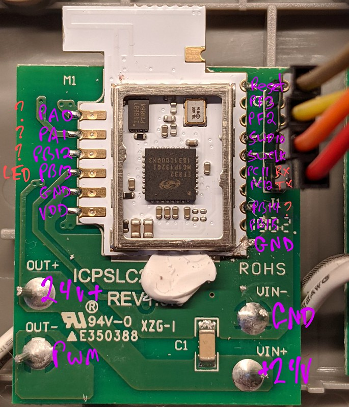
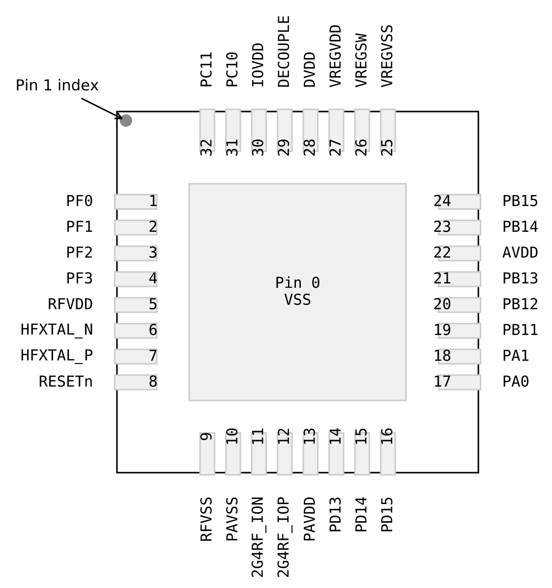

[](../../../../actions?query=workflow%3Aefm32-build)



# The Micropython port for the Silcon Labs EFM32

This port of Micropython runs in the Gecko boards used in the Ikea
Tradfri lighting hardware and should be portable to other Silican Labs
EFM32 boards.  This is the underlying hardware firmware, for the
ZigBee software layer, see [osresearch/ZbPy](https://github.com/osresearch/ZbPy).

The one used for most of the testing is the LED 10W dimmer shown above,
which has the Gecko board as a module inside the case as well as easy to
access SWD pins for reprogramming.  The console pins require soldering
extra jumpers.

If you want to have code run at boot up, you can either add it to
the `modules/__init__.py` file, or you can create `boot.py` on the
SPI flash device.  Once the machine is booted, run this at the repl:

```
f = open("boot.py","w")
f.write('import foo')
f.close()
import machine
machine.reset()
```

Now that uart interrupts are supported you can stop the boot script with `^C`.

# EFM32 features



The EFR32MG1P132G1 ([Datasheet](https://www.silabs.com/documents/public/data-sheets/efr32mg1-datasheet.pdf) and
[Reference Manual](https://www.silabs.com/documents/public/reference-manuals/efr32xg12-rm.pdf))
is the microcontroller used in the Ikea devices.
Some on SiLabs modules, some with the bare QFN48 package on the board.
The MCU has 256 KB of internal flash, 32 KB of internal RAM and Ikea adds
an external SPI flash for storing OTA images or other things.

* [Gecko SDK](https://github.com/SiliconLabs/Gecko_SDK)
* [SDK documentation](https://siliconlabs.github.io/Gecko_SDK_Doc/)
* [IO Device to Pin Location mapping](efr32mg1p-pins.md)

## Supported features
* It boots!
* The REPL reads and writes to the serial port
* The radio module can send and receive 802.15.4 packets
* Frozen modules work -- add files into the `modules` directory to bundle them into the image
* GPIO using the `from machine import Pin` library
* External SPI flash as a vfs blockdev, allowing file IO operations
* Self programming into the SPI flash
* TX UART FIFO, so that the CPU isn't busywaiting on the serial port
* RX UART FIFO, so that long running operations don't drop serial datat
* Interrupting the REPL - you can now hit ^C and stop an infinite loop!
* One PWM channel is supported; the `machine.pwm` module needs some rethink.
* Much of the Zigbee protocol is in the [ZbPy tree](https://github.com/osresearch/zbpy), including decrypting, validating, and parsing messages through to ZCL.
* zrepl: a console over the 802.15.4 radio for remote access

## Not yet supported
* Sleep modes - should be able to sleep until radio or button press
* Interrupts
* Timer functions
* RTC
* Zigbee OTA: Over the air updates to the firmware
* Bluetooth LE
* Thread?

# No Warranty!

This is very beta and likely voids your Ikea warranty.

# Building for an EFM32 MCU

For the first build it is necessary to build the `mpy-cross` directory
so that frozen MicroPython files can be created:

	make -C ../../mpy-cross

The `Makefile` is setup to build for the EFR32MG1P cpu and enables a UART
for communication.  To build in this directory:

	make

This version of the build should work out-of-the-box on a Ikea 10w LED
dimmer (and anything similar), and will give you a MicroPython REPL on
UART1 at 115200 baud (output on PC10, input on PC11).  For the small
On/Off remote and the 5-way remote, the UART is routed to a port on
the bottom of the case and uses TX on PB15 and RX on PB14.  There is a
compile time define in `uart_core.c`.
More devices are identified in [trmm.net/Ikea](https://trmm.net/Ikea).

The high-current LED driver is on pin PB13 for the 10W.  The PWM driver
is not yet supported.

For the 5-way remote, the known pins are 0 for the reset button on the bottom (with an external pullup) and 3 for the red LED.

SWD is on PF1(SWCLK) and PF0(SWD).  Installation is easiest with OpenOCD or
similar SWD probe.  The [Teensy CMSIS-DAP](https://github.com/osresearch/arduino-cmsis-dap)
is an easy way if you already have a Teensy microcontroller around.

The stock OpenOCD with Ubuntu doesn't work with the CSMSIS-DAP, so build from [github source](https://github.com/ntfreak/openocd) and be sure to run `./configure --enable-cmsis-dap`.
To setup the OpenOCD server, in one window run `make openocd`:

```
sudo openocd  -f interface/cmsis-dap.cfg -f board/efm32.cfg
```

and in another window run `make gdb`:

```
gdb-multiarch \
	-iex 'target remote localhost:3333 ; display /i $pc' \
	build/firmware.elf
```

Once in `gdb` it is possible to build, flash, debug, and reboot the device:

* `make -j8` to build a firmware
* `load` to send it to the target,
* `monitor reset halt` to reset and hold the device in reset
* `c` to restart the execution
* `br HardFault_Handler` to add a breakpoint when the hard fault handler is called


# RAIL

The RAIL library overrides some interrupts, which are marked as `weak` in startup code:
* ` RFSENSE_IRQHandler`
* ` AGC_IRQHandler`
* ` BUFC_IRQHandler`
* ` FRC_IRQHandler`
* ` FRC_PRI_IRQHandler`
* ` MODEM_IRQHandler`
* ` PROTIMER_IRQHandler`
* ` RAC_RSM_IRQHandler`
* ` RAC_SEQ_IRQHandler`
* ` SYNTH_IRQHandler`

There is a Python interface to the EFM32 radio module in [`radio.c`](radio.c) that provides a few methods:

* `Radio.init()`
* `Radio.promiscuous(bool)`
* `Radio.rx()` -- returns `ByteArray` of packet or `None` if no packets are waiting
* `Radio.tx(bytes)` -- transmits a raw packet; the user must fill in all of the headers, although the radio adds the FCS
* `Radio.address(nwk_addr, pan_id)` -- configures the short address and PAN ID for non-promiscuous reception


# Licensing

Micropython is redistributed under a MIT license.  See [`../../LICENSE`](../../LICENSE)
for the contents.

The `emlib` directory is derived from 5.8.0 and has the
following zlib license:

```
 * SPDX-License-Identifier: Zlib
 *
 * The licensor of this software is Silicon Laboratories Inc.
 *
 * This software is provided 'as-is', without any express or implied
 * warranty. In no event will the authors be held liable for any damages
 * arising from the use of this software.
 *
 * Permission is granted to anyone to use this software for any purpose,
 * including commercial applications, and to alter it and redistribute it
 * freely, subject to the following restrictions:
 *
 * 1. The origin of this software must not be misrepresented; you must not
 *    claim that you wrote the original software. If you use this software
 *    in a product, an acknowledgment in the product documentation would be
 *    appreciated but is not required.
 * 2. Altered source versions must be plainly marked as such, and must not be
 *    misrepresented as being the original software.
 * 3. This notice may not be removed or altered from any source distribution.
 *
```

The `gecko_sdk` directories are copyright Silicon Laboratories
and are redistributed under a modified 3-clause BSD license:

```
Copyright 2016 Silicon Laboratories, Inc. http://www.silabs.com

 * Permission is granted to anyone to use this software for any purpose,
 * including commercial applications, and to alter it and redistribute it
 * freely, subject to the following restrictions:
 *
 * 1. The origin of this software must not be misrepresented; you must not
 *    claim that you wrote the original software.
 * 2. Altered source versions must be plainly marked as such, and must not be
 *    misrepresented as being the original software.
 * 3. This notice may not be removed or altered from any source distribution.
```

The `startup_efr32mg1p.c` and `system_efr32mg1p.c` files are
copyright ARM Limited and are redistributed under an unmodified 3-clause BSD license:

```
   Copyright (c) 2011 - 2014 ARM LIMITED

   All rights reserved.
   Redistribution and use in source and binary forms, with or without
   modification, are permitted provided that the following conditions are met:
   - Redistributions of source code must retain the above copyright
     notice, this list of conditions and the following disclaimer.
   - Redistributions in binary form must reproduce the above copyright
     notice, this list of conditions and the following disclaimer in the
     documentation and/or other materials provided with the distribution.
   - Neither the name of ARM nor the names of its contributors may be used
     to endorse or promote products derived from this software without
     specific prior written permission.
```

The RAIL RF modem library has its own license in [`rail/Silabs_License_Agreement.txt`](rail/Silabs_License_Agreement.txt).
